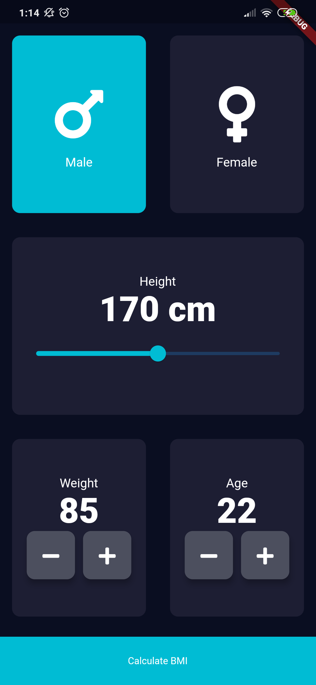
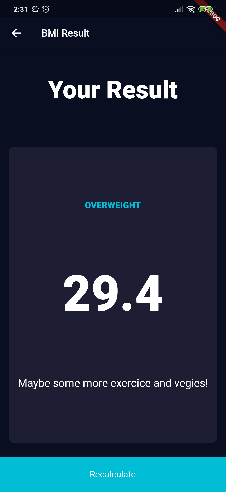

# BMI Calculator

This is a modified version of the BMI Calculator intended as a learning resource for The App Brewery's Complete Flutter Development Bootcamp.

## Our Goal

The objective of this tutorial is to look at how we can customise Flutter Widgets to achieve our own beautiful user interface designs. If you have a designer on board, no matter how unconventional their designs are, we can create them using Flutter. 

>This is a companion project to The App Brewery's Complete Flutter Development Bootcamp, check out the full course at [www.appbrewery.co](https://www.appbrewery.co/)

